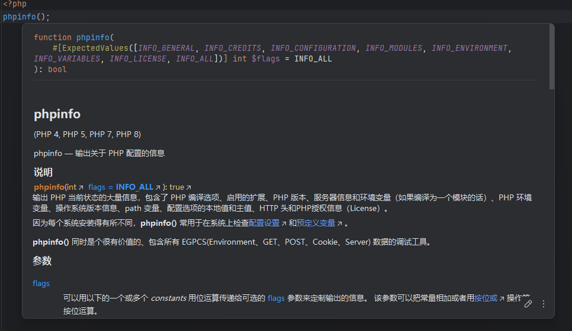

# PhpStorm插件 php-chinese-manual

## 简介

本项目是基于 [phpstorm-stubs-chinese](https://github.com/Hyouka0510/phpstorm-stubs-chinese) 项目构建的PHP基本函数中文速查手册。旨在为PHP开发者提供一个便捷的中文注释查询工具，尤其适用于在JetBrains PhpStorm IDE中进行开发的用户。

通过集成此速查手册，您可以在编写PHP代码时，利用PhpStorm的默认快捷键 `Ctrl+Q` (或macOS上的 `F1`) 快速查阅PHP内置函数的中文注释，极大地提高开发效率和代码理解能力。

## 特性

*   **中文注释支持**: 为PHP核心函数提供清晰、准确的中文注释。
*   **PhpStorm集成**: 完美兼容PhpStorm IDE，通过快捷键快速查询。
*   **基于项目**: 继承自 [phpstorm-stubs-chinese](https://github.com/Hyouka0510/phpstorm-stubs-chinese)，保证注释质量和覆盖范围。
*   **提升开发效率**: 减少查阅官方文档的时间，直接在IDE中获取信息。

## 如何安装与使用

本插件支持两种安装方式：

### 方式一：通过 JetBrains 官方插件市场安装 (推荐)

这是最推荐的安装方式，简单快捷，且能自动获取更新。

1.  打开 PhpStorm。
2.  进入 `File` -> `Settings` (或macOS上的 `PhpStorm` -> `Preferences`)。
3.  在左侧导航栏中，选择 `Plugins`。
4.  点击 `Marketplace` 选项卡。
5.  在搜索框中输入 `PHP Chinese Manual`。
6.  找到本插件，点击 `Install` 按钮。
7.  安装完成后，根据提示重启 PhpStorm。

### 方式二：手动安装插件包

如果您无法访问插件市场，或者需要安装特定版本的插件，可以从GitHub下载打包好的插件文件进行手动安装。

1.  访问本项目的 [GitHub Releases 页面](https://github.com/Hyouka0510/php-chinese-manual-plugin/releases)。
2.  下载最新版本的 `.jar` 插件包文件（例如 `php-chinese-manual-plugin-X.X.X.jar`）。**请勿解压此文件。**
3.  打开 PhpStorm。
4.  进入 `File` -> `Settings` (或macOS上的 `PhpStorm` -> `Preferences`)。
5.  在左侧导航栏中，选择 `Plugins`。
6.  点击 `Plugins` 页面顶部的齿轮图标 (⚙️)，然后选择 `Install Plugin from Disk...`。
7.  导航到您下载的 `.jar` 插件包文件，选中并点击 `OK`。
8.  安装完成后，根据提示重启 PhpStorm。

### 使用方法

安装并重启PhpStorm后，您就可以在IDE中享受中文注释的便利了：

1.  在您的PHP代码中，将光标移动到任何PHP内置函数（例如 `strlen`、`array_push` 等）上。
2.  按下默认快捷键 `Ctrl + Q` (Windows/Linux) 或 `F1` (macOS)。
3.  PhpStorm 将会弹出一个快速文档窗口，显示该函数的中文注释。

## 贡献

我们欢迎任何形式的贡献，包括但不限于：

*   **提交 Bug 报告**: 如果您发现任何错误或不准确的注释。
*   **改进现有注释**: 提交更清晰、更准确的中文注释。
*   **添加缺失的注释**: 补充尚未翻译的函数注释。
*   **功能建议**: 提出任何可以改进本项目或使用体验的建议。

请通过 [GitHub Issues](https://github.com/Hyouka0510/php-chinese-manual-plugin/issues) 提交问题或建议，并通过 [Pull Requests](https://github.com/Hyouka0510/php-chinese-manual-plugin/pulls) 提交您的代码贡献。

## 鸣谢

本项目基于 [Hyouka0510/phpstorm-stubs-chinese](https://github.com/Hyouka0510/phpstorm-stubs-chinese) 项目构建，在此向原作者表示衷心感谢！

## 许可证

本项目采用 [MIT 许可证](https://github.com/Hyouka0510/php-chinese-manual-plugin/blob/main/LICENSE) 发布。