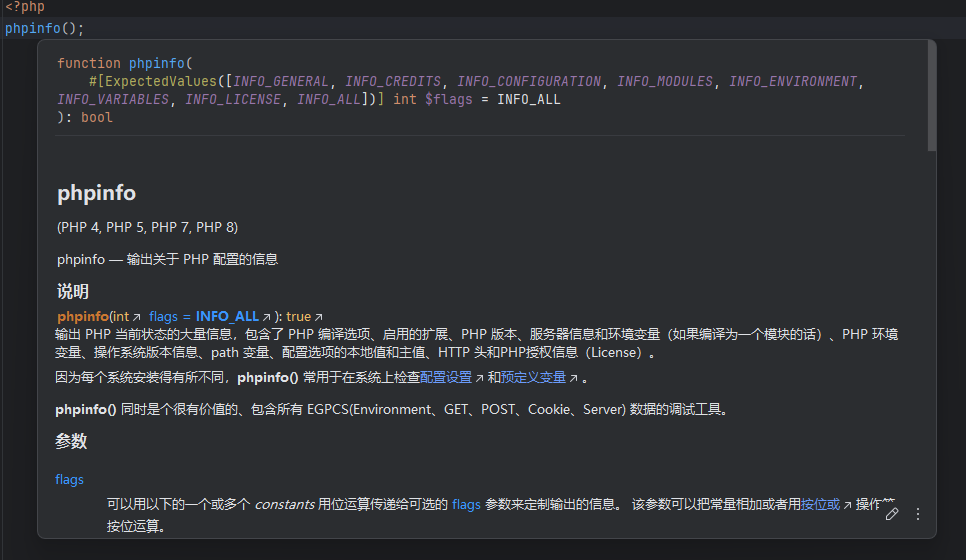

# PHP Chinese Manual

[](LICENSE)

PHP Chinese Manual 是一个面向 PhpStorm 的 PHP 中文快速文档插件。安装后，将光标放在 PHP 内置函数、类、方法、常量或预定义变量上，即可通过 PhpStorm 的 Quick Documentation 查看来自 PHP 中文手册的说明。

插件不联网查询文档，也不在 IDE 运行期间翻译文本。它把 [phpstorm-stubs-chinese](https://github.com/Hyouka0510/phpstorm-stubs-chinese) 生成的、带中文 PHPDoc 的 JetBrains `phpstorm-stubs` 作为插件资源打包，并注册为 PhpStorm 的 PHP 外部库。



## 使用方式

### 从 JetBrains Marketplace 安装

1. 打开 PhpStorm 的 `Settings/Preferences | Plugins | Marketplace`。
2. 搜索 `PHP Chinese Manual` 并安装。
3. 按 IDE 提示重启。

也可以从本项目的 [Releases](https://github.com/Hyouka0510/php-chinese-manual-plugin/releases) 下载发布的插件 ZIP，然后在 `Settings/Preferences | Plugins` 的齿轮菜单中选择 `Install Plugin from Disk...`。安装 ZIP 时不要解压。

### 查看中文文档

将光标放到 PHP 声明或调用处，执行 `Quick Documentation`：

- Windows/Linux 默认快捷键：`Ctrl+Q`
- macOS 默认快捷键：`F1`

快捷键可能被用户键位映射修改，可在 `Settings/Preferences | Keymap` 中搜索 `Quick Documentation` 查看实际绑定。

## 工作原理

插件的运行时结构很小，实际功能由 `plugin.xml` 和随包资源共同完成：

```text
PHP 中文文档源码
        |
        v
phpstorm-stubs-chinese
  提取中文 XHTML + 合并 JetBrains stubs
        |
        v
src/main/resources/library/
  带中文 PHPDoc 的 PHP stub 文件
        |
        v
plugin.xml: <libraryRoot path="/library/" ... />
        |
        v
PhpStorm PHP 索引与 Quick Documentation
```

`src/main/resources/META-INF/plugin.xml` 中的关键配置是：

```xml
<depends>com.intellij.modules.platform</depends>
<depends>com.jetbrains.php</depends>

<extensions defaultExtensionNs="com.jetbrains.php">
    <libraryRoot id="library" path="/library/" runtime="true" order="first"/>
</extensions>
```

- `com.jetbrains.php` 表示插件依赖 PhpStorm/PHP 插件能力。
- `/library/` 指向插件 JAR 资源根中的 `library` 目录，即源码中的 `src/main/resources/library/`。
- `runtime="true"` 使该库在 IDE 运行时参与 PHP 索引。
- `order="first"` 让中文 stubs 优先参与文档解析。

因此本项目没有 Java/Kotlin 业务实现，也不修改用户项目文件。中文文档是否出现，取决于生成的 stub 中是否存在对应声明和中文 PHPDoc，以及 PhpStorm 对该声明的解析结果。

## 项目结构

```text
php-chinese-manual-plugin/
├── .github/workflows/main.yml             # 标签触发的构建、验证和发布流程
├── images/screenshot-1.png                # README 使用截图
├── src/main/resources/
│   ├── META-INF/plugin.xml                # 插件元数据、依赖和 libraryRoot 注册
│   ├── META-INF/pluginIcon.svg            # 插件图标
│   └── library/                           # 生成后的中文 phpstorm-stubs
├── build.gradle.kts                       # IntelliJ Platform/签名/发布配置
├── gradle.properties
├── settings.gradle.kts
└── gradlew / gradlew.bat
```

`library/` 是本插件体积和功能的主体。中文翻译、HTML 清理和 stub 合并逻辑不在本仓库中维护，而在 `phpstorm-stubs-chinese` 中完成。

## 环境与兼容性

- JDK 17
- Gradle Wrapper（无需另行安装 Gradle）
- 构建基准 IDE：PhpStorm `2022.2`，IntelliJ Platform 类型为 `PS`
- 构建时依赖 PHP 插件：`com.jetbrains.php`
- 当前插件版本：`1.2.0`
- `since-build`：`203`
- 未设置 `until-build`

`since-build=203` 来自当前 Gradle 和 `plugin.xml` 配置，表示最低兼容 IntelliJ Platform 2020.3 系列构建。实际兼容性仍应以 `verifyPlugin` 结果和 JetBrains Marketplace 的兼容性检查为准。

## 本地构建

先确认 `src/main/resources/library/` 已包含由 `phpstorm-stubs-chinese` 生成的完整目录，然后执行：

```bash
./gradlew clean buildPlugin
```

构建结果位于：

```text
build/distributions/PHP Chinese Manual-<version>.zip
```

常用开发命令：

```bash
# 启动带插件的沙箱 IDE
./gradlew runIde

# 构建可安装 ZIP
./gradlew buildPlugin

# 验证插件结构与兼容性
./gradlew verifyPlugin
```

版本号同时存在于 `build.gradle.kts` 和 `src/main/resources/META-INF/plugin.xml`。发布前应保持两处一致；Gradle 的 `patchPluginXml` 会在构建产物中写入项目版本及兼容范围。

## 更新中文 stubs

完整更新链路如下：

1. 在 `phpstorm-stubs-chinese` 仓库运行其 GitHub Actions 或本地 `composer build`。
2. 取得生成的 `resources/library/`，或下载名为 `phpstorm-stubs-chinese` 的 Actions artifact。
3. 用 artifact 内容替换本项目的 `src/main/resources/library/`。
4. 运行 `./gradlew buildPlugin` 和 `./gradlew verifyPlugin`。
5. 在沙箱 IDE 中抽查函数、类方法、常量和超全局变量的 Quick Documentation。

目录层级必须是：

```text
src/main/resources/library/Core/Core.php
src/main/resources/library/standard/standard.php
...
```

不能多套一层 `library/`，否则插件中的 `/library/` 根路径无法找到 stubs。

## GitHub Actions 发布流程

`.github/workflows/main.yml` 在推送 `v*` 标签时触发，定义了三个任务：

1. `build`：准备 JDK/Gradle，下载 `phpstorm-stubs-chinese` 最近一次成功工作流的 artifact，构建并验证插件，然后上传构建产物。
2. `release`：仅当仓库 Secret `ENABLE_MARKETPLACE_PUBLISH=1` 时运行；使用证书和 Marketplace Token 签名、发布插件。
3. `github-release`：重新构建插件，并使用当前标签创建 GitHub Release。

涉及的 Secrets：

- `GH_PAT`：跨仓库下载 stubs artifact。
- `ENABLE_MARKETPLACE_PUBLISH`：是否启用 Marketplace 发布。
- `PUBLISH_TOKEN`：JetBrains Marketplace Token。
- `CERTIFICATE_CHAIN`、`PRIVATE_KEY`、`PRIVATE_KEY_PASSWORD`：插件签名材料。

> 维护注意：当前工作流将下载内容解压到 `src/main/library/`，但 Gradle 默认资源目录和 `plugin.xml` 的 `/library/` 实际对应 `src/main/resources/library/`。自动发布若要真正使用新 artifact，应把工作流目标目录调整为 `src/main/resources/library/`，或显式配置 Gradle `sourceSets` 将 `src/main/library/` 纳入资源；两处约定必须统一。

## 常见问题

### 安装后没有中文说明

先确认光标所在符号是 PHP 内置/扩展声明，而不是项目或第三方依赖中的同名实现；随后尝试重新索引或重启 IDE。某些扩展、较新的 PHP API 或中文手册尚未覆盖的声明会保留 JetBrains 原始英文 PHPDoc。

### 是否会影响代码执行或部署

不会。插件只向 IDE 注册声明库，用于索引、补全和文档展示，不会向项目写入 PHP 文件，也不会参与 PHP 运行时加载。

### 为什么部分内容仍是英文

生成器在匹配到中文手册条目时，会把中文片段插入 JetBrains 原有 PHPDoc，而不是删除所有原始注释。未匹配条目会完整保留原始 stub 内容。

## 相关项目

- [phpstorm-stubs-chinese](https://github.com/Hyouka0510/phpstorm-stubs-chinese)：生成带中文 PHPDoc 的 stubs。
- [JetBrains/phpstorm-stubs](https://github.com/JetBrains/phpstorm-stubs)：PhpStorm 使用的 PHP API 声明源。
- [PHP 中文手册](https://www.php.net/manual/zh/)：中文说明的上游来源。

## 许可证

本项目使用 [MIT License](LICENSE)。PHP 文档和 JetBrains stubs 的内容分别遵循其上游项目的许可条款。
